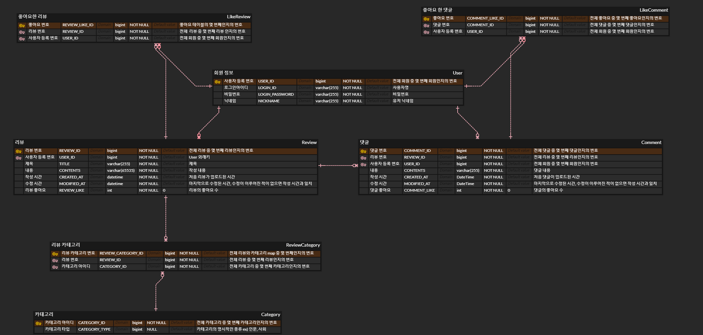
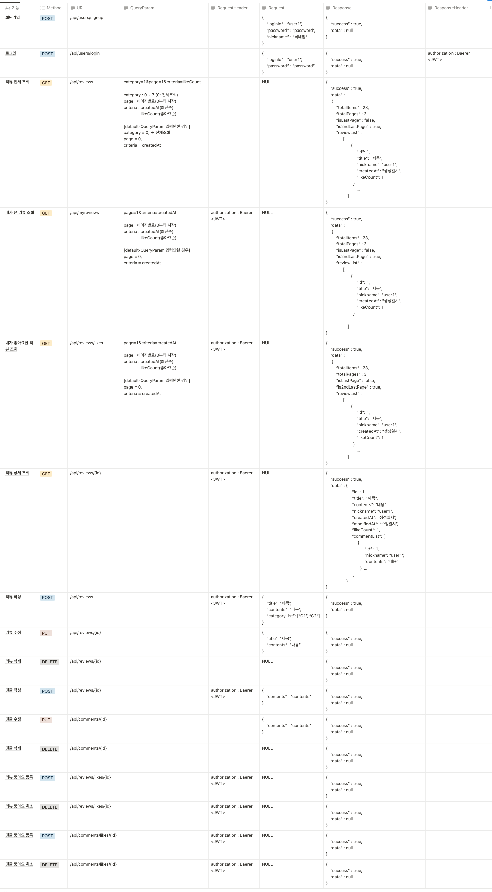

# ⭐️ 프로젝트 소개

자신이 읽은 책을 리뷰 해서 공유를 해보세요.

다른 사용자의 리뷰에 댓글을 달아서 자신의 생각을 적어 보세요.

리뷰가 마음에 들거나 댓글이 마음에 들면 좋아요를 눌러주세요.

## 🐢 프로젝트 이름

꼬북이들(Go-Book)

## 📆 개발기간

2022 . 2. 24 ~ 2022 . 3 . 2

## 🛠️ 기술스택

- FE
    - React
- BE
    - Java
    - Spring
    - MySQL

## 💡 구현기능
- 로그인 기능
    - 유효성 검사를 통과한 ID, PW인 경우만 회원가입이 가능하다.
    - JWT 토큰을 이용하여 Spring Security로 인증/인가를 구현한다.
- 독서 리뷰 등록
    - 로그인을 하면 책에 대한 리뷰를 등록할 수 있다.
    - 본인이 작성한 리뷰만 수정/삭제가 가능하다.
- 독서 리뷰 조회
    - 모든 사용자가 작성한 독서 리뷰를 조회할 수 있다. - Pagination
    - 책 카테고리별(ex. 인문 / 사회 / 경제 / 소설 등) 조회가 가능하다.
    - 작성일자, 좋아요 개수 순으로 정렬할 수 있다.
- 마이페이지 조회
    - 내가 작성한 리뷰를 볼 수 있다.
    - 내가 좋아요한 리뷰를 볼 수 있다.
- 댓글 등록
    - 독서 리뷰에 댓글을 달 수 있다.
    - 본인이 작성한 댓글만 수정/삭제가 가능하다.
- 좋아요 기능
    - 독서 리뷰, 댓글에 좋아요를 누를 수 있다.
    - 이미 좋아요를 누른 상태에서 다시 한번 누르면 좋아요가 취소된다.

---

## 📋 와이어 프레임

[와이어프레임 보기](https://www.figma.com/file/pXVtDukCzJHbO0VN8O2rjH/Untitled?node-id=0%3A1&t=BDRI1YjfzprBuk7I-1)

---

## 📄 ERD

---

## 📜 API 문서

---
## ✋ 조원 정보
|이름|  구분   |        업무파트        |           Github 주소           |
|:---:|:-----:|:------------------:|:-----------------------------:|
|김도연|  백엔드  | 리뷰 조회, pagination  |  https://github.com/dev-dykim |
|김현호|  백엔드  |      댓글 CRUD       | https://github.com/cho-coding |
|조민성|  백엔드  | 회원가입, 로그인, 좋아요 기능  |  https://github.com/Ganpyeon  |
|홍예석|  백엔드  | 리뷰 CRUD, DB, 서버 배포 | https://github.com/yshong1998 |
|최승호| 프론트엔드 | 로그인, 회원가입, 마이페이지 |  https://github.com/boompeak  |
|전찬열| 프론트엔드 | 상세 리뷰 페이지, 리뷰 작성 페이지 | https://github.com/chanyeol123 |
|이주애| 프론트엔드 | 페이지 이동, 카테고리 필터링, 리뷰 정렬 | https://github.com/leejuae1020 |

